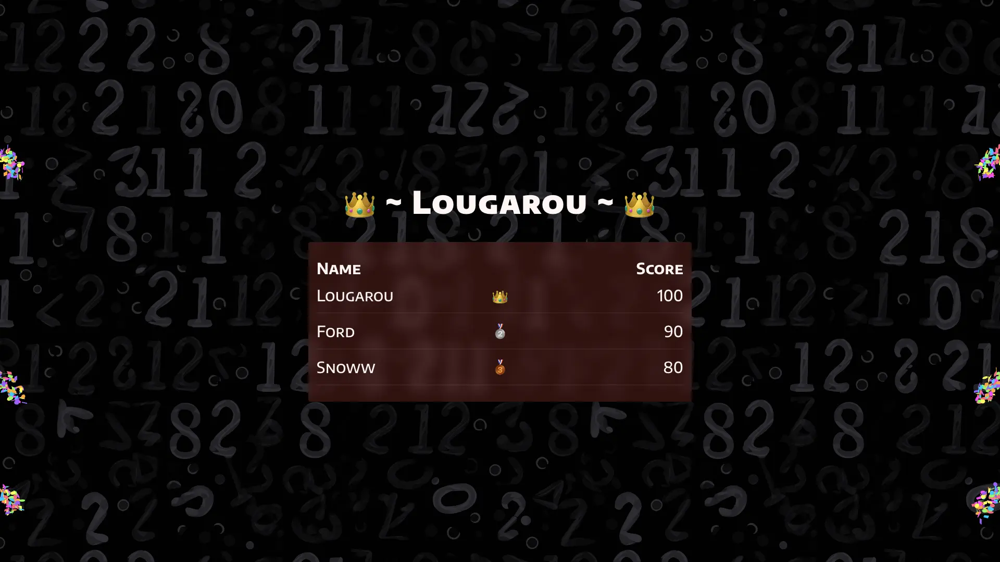
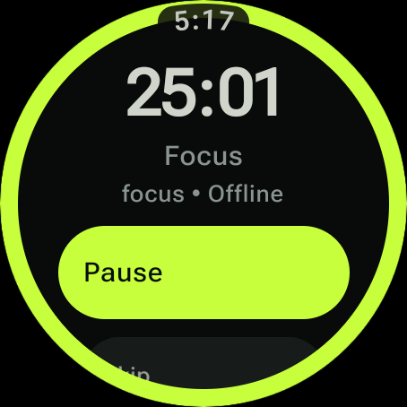
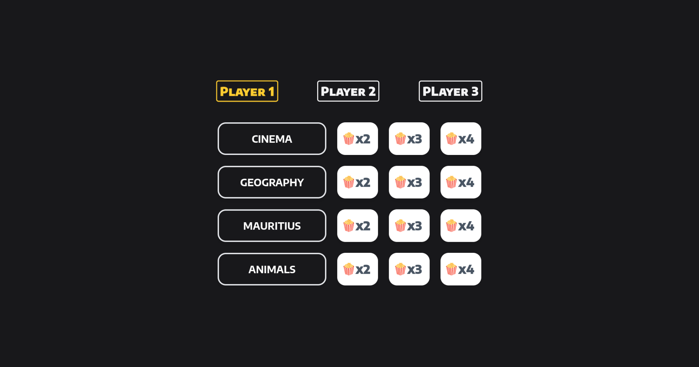
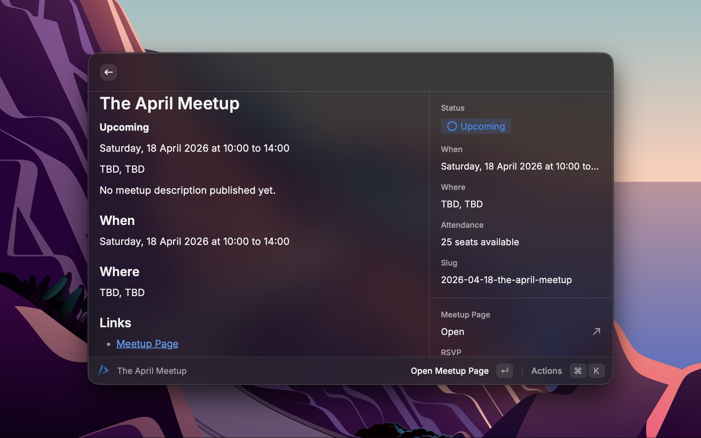
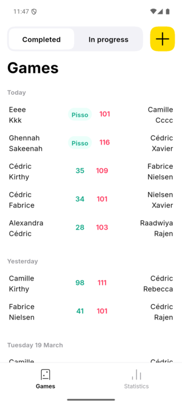

# Cedric

I build small, useful products around real workflows: event communities, live games, personal focus tools, local AI assistants, and automation systems.

Most of my current product code lives in private repositories. This profile is the public shelf: what the products do, what shipped, and where you can try or inspect the work.

## Shipping

<table>
  <tr>
    <td width="50%" valign="top">
      
      <h3>LePopQuiz</h3>
      
Multiplayer quiz product for live events, TV screens, teams, and mobile players.

      
<a href="https://lepopquiz.app">Open product</a>

    </td>
    <td width="50%" valign="top">
      
      <h3>Pomo</h3>
      
Shared pomodoro timer across web, macOS menu bar, Android, Wear OS, widgets, and Raycast.

      
<a href="https://pomo.lerisquetout.app">Open product</a>

    </td>
  </tr>
  <tr>
    <td width="50%" valign="top">
      
      <h3>Le Risque Tout</h3>
      
Nuxt product backed by MongoDB, Docker deployment, and a WhatsApp booking workflow.

      
<a href="https://lerisquetout.app">Open product</a>

    </td>
    <td width="50%" valign="top">
      
      <h3>Coders.mu Clients</h3>
      
CLI, hosted API, Raycast extension, and macOS menu bar app for Mauritius developer meetups.

      
<a href="https://codersmu.cedpoilly.dev/meetups/next">Open API</a> - <a href="https://frontend.coders.mu">Community site</a>

    </td>
  </tr>
  <tr>
    <td width="50%" valign="top">
      
      <h3>Dominoes</h3>
      
Flutter scorekeeping app with mobile release workflows, seeded demo data, and regression coverage.

    </td>
    <td width="50%" valign="top">
      <h3>Local AI Tooling</h3>
      
Hands-free voice loops, local Kokoro TTS, Codex thread announcements, and personal automation tools.

      
Built with TypeScript, SwiftUI, Python, Nitro, and local-first macOS services.

    </td>
  </tr>
</table>

## What I Usually Build

- Product prototypes that become real daily tools
- Nuxt, Vue, TypeScript, Node.js, SwiftUI, Flutter, Android, and Wear OS apps
- Developer-community tools for Coders.mu and Front-End Coders Mauritius
- Local-first AI and automation workflows for my own machine
- Practical deployment pipelines with Docker, GHCR, Coolify, GitHub Actions, and health checks

## Public Links

- LinkedIn: [in/cedpoilly](https://www.linkedin.com/in/cedpoilly)
- Twitch: [cedpoilly](https://www.twitch.tv/cedpoilly)
- X: [@cedpoilly](https://twitter.com/cedpoilly)
